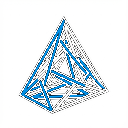

#  Simplex


**Simplex** is a lightweight optimization mod for Minecraft Fabric, designed to enhance performance through intelligent rendering culling and logic improvements without compromising the vanilla experience.

## ✨ Key Features

### 🎮 Rendering

- **Entity Culling**: Automatically stops rendering entities that are obscured or too far away.
  - _Configurable Distance_: Default 64 blocks.
- **Particle Culling**: Reduces particle rendering load based on distance.
- **Fast Math**: Optimized mathematical functions for rendering calculations.

### 🧠 Logic & Tick

- **Lazy Entity Ticking**: Reduces tick frequency for distant entities.
- **Distant AI Optimization**: Simplifies mob AI when players are far away.
- **Fast XP**: Optimized experience orb handling.

### 🌐 Network & System

- **Low Latency Mode**: Synchronizes frame buffers to reduce input lag (`glFinish` injection).
- **Explicit GC**: Optional aggressive garbage collection on world exit to free memory.

## ⚙️ Configuration

Simplex is highly configurable. The configuration file is generated at `.minecraft/config/simplex.json`.

```json
{
  "enableEntityCulling": true,
  "entityCullingDistance": 64,
  "enableFastMath": true,
  "enableGpuOptimizations": true,
  "enableParticleCulling": true,
  "enableLazyEntityTicking": true,
  "enableLowLatency": false
}
```

## 🛠️ Building from Source

To build Simplex from source, you need JDK 21 installed.

```bash
# Clone the repository
git clone https://github.com/yourusername/simplex.git

# Navigate to the directory
cd simplex

# Build the mod
./gradlew build
```

The compiled jar file will be located in `build/libs/`.

## 📄 License

This project is licensed under the **CC0-1.0** license. You are free to use, modify, and distribute this software without restriction.
